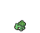
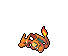
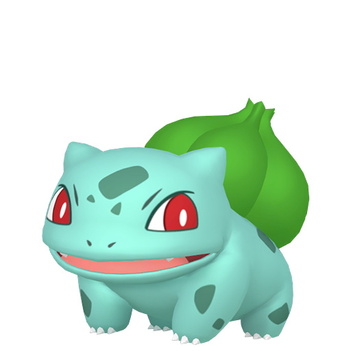
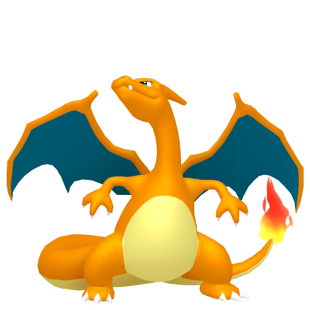
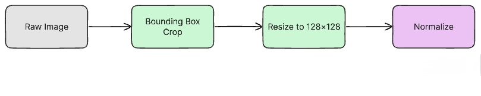
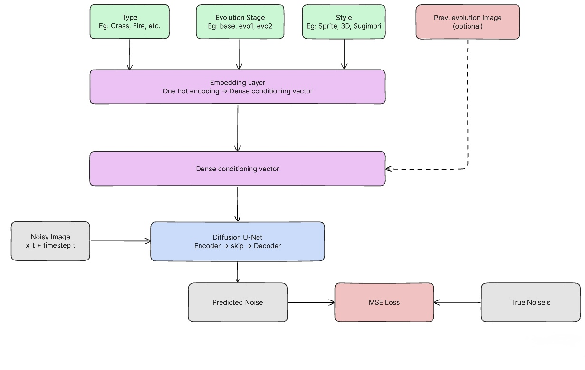
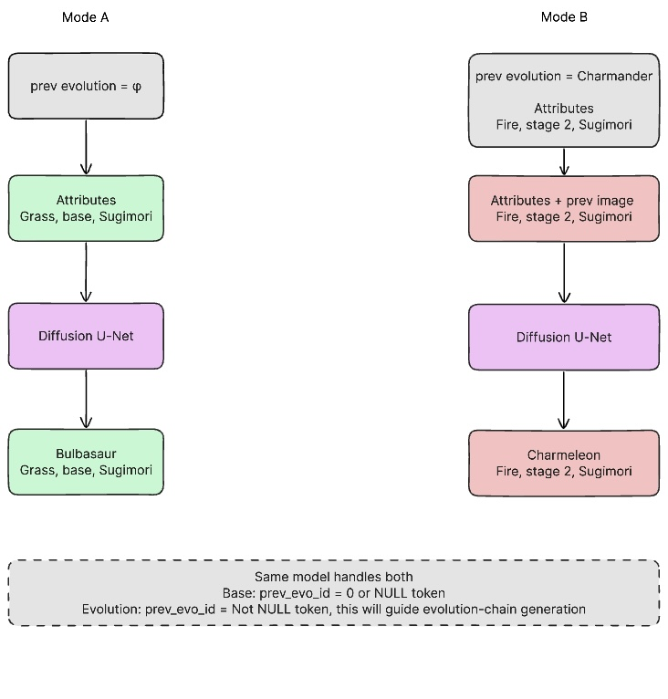
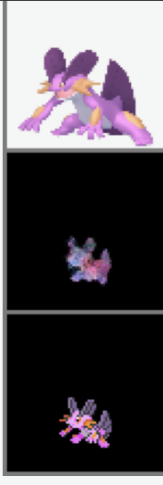

<!-- _class: center -->
<!-- _backgroundColor: "#0f3460" -->
<!-- _color: "#ffffff" -->

# Diffusion-Based Generation of Novel Pokémon

## with Conditional Evolution Modeling

**MSML 612 — Final Presentation**
Aaron Cyril John, Yugaank Kalia, Varen Maniktala

---

## Outline

1. Problem Motivation & Recap
2. From GAN Baseline to Conditional Diffusion
3. Dataset & Curation Challenges
4. Preprocessing Pipeline
5. Diffusion System Architecture
6. Conditioning Design (Type / Style / Stage / Prev-Evo)
7. Training Procedure
8. Reproducibility & Code Organization
9. Results (Unconditional, Type-, Style-, Evolution-Conditioned)
10. Evaluation, Runtime & Ablations
11. Discussion, Limitations & Future Work

---

## Problem Motivation

**Goal:** Generate novel, visually coherent Pokémon designs under structured conditional controls.

| Challenge                    | Why It Matters                                                                          |
| ---------------------------- | --------------------------------------------------------------------------------------- |
| Multi-source style alignment | Official art, game sprites, and 3D renders must correspond                              |
| Attribute conditioning       | Type, evolution stage, and style must guide generation                                  |
| Evolution chain coherence    | Generated forms must remain visually related across a chain                             |
| Domain-specific structure    | Pokémon generation is not just image synthesis: it is structured conditional generation |

> Standard unconditional image generators cannot capture evolution progression or type-based stylistic cues.

---

## From GAN Baseline to Conditional Diffusion

**Why move past the GAN baseline?**

- The preliminary image-to-image GAN captured broad **color palettes** and rough **silhouettes** of target sprites
- It struggled with **fine-grained detail**, **sharp edges**, and **mode coverage** (outputs collapsed toward average sprites)
- It was fundamentally a **translator**, not a **generator**: it could only replay styles it had been shown paired with

**What a conditional diffusion model gives us instead**

- **Iterative denoising** produces sharper, higher-frequency detail than a single-pass GAN generator
- Naturally supports **structured conditioning** (type, style, stage, reference image) via FiLM + cross-attention
- Supports **true generation** of unseen Pokémon, not just translation of existing ones
- Training is more **stable** (no adversarial collapse) on our relatively small (~2k–6k) dataset

---

## Dataset Overview 

Three complementary image sources, now unified into a single **diffusion-ready** training set with type, stage, and style labels.

| Source            | Files | Role                                               |
| ----------------- | ----- | -------------------------------------------------- |
| SugimoriSprites   | 1,848 | High-quality 2D reference art                      |
| PokeSprite        | 2,853 | Game-style sprite (primary target domain)          |
| ProjectPokemon 3D | 2,799 | Alternate visual domain for cross-format variety   |

**Diffusion-ready mappings** (with `types` + `evolution_stage` + `art_style`):

| Mapping File                                      | Entries | Role                                      |
| ------------------------------------------------- | ------- | ----------------------------------------- |
| `safe_sprite_to_sprite_types_evolution.json`      | 1,995   | Sprite → Sprite (+ prev-evo image)        |
| `safe_sugimori_to_sugimori_types_evolution.json`  | 1,674   | Sugimori → Sugimori (+ prev-evo image)    |
| `safe_project_to_project_types_evolution.json`    | 2,704   | 3D → 3D (+ prev-evo image)                |
| **Total training entries**                        | **6,373** | Merged in `PokemonDiffusionDataset`    |

---

## Data Sources: Visual Comparison

| Style                              | Bulbasaur                                                                                                        | Charizard                                                                                                        |
| ---------------------------------- | ---------------------------------------------------------------------------------------------------------------- | ---------------------------------------------------------------------------------------------------------------- |
| **SugimoriSprites** (Official Art) |                          |                          |
| **PokeSprite** (Game Sprite)       |                                    |                                    |
| **ProjectPokemon 3D**              |  |  |

> Each source captures a different visual style of the **same** Pokémon: cross-format alignment is critical.

---

<!-- _class: tight -->

## Dataset Enrichment: Types + Evolution Stage

**Per-entry schema** (JSON):

```json
{
  "prev": "bulbasaur", "next": "ivysaur",
  "prev_sprite": "poke-data/PokeSprite/0001bulbasaur/bulbasaur.png",
  "next_sprite": "poke-data/PokeSprite/0002ivysaur/ivysaur.png",
  "types": ["grass", "poison"], "evolution_stage": "evo 1", "art_style": "sprite"
}
```

**Curation challenges we had to solve** (not off-the-shelf):

- **Cross-format name collisions** — same Pokémon, different filename conventions across sources (e.g. `0006 Charizard.png` vs `charizard.png` vs `poke_capture_0006_*.png`); resolved via normalized lookup against `poke-data/pokedex.json`
- **Regional / cosmetic variants** — `meowth-galar`, `bulbasaur shiny`, mega, gigantamax share base IDs; stripped and tagged so type lookup stays unambiguous
- **Evolution-stage resolution** — no source labels stage directly; derived via **BFS over `prev → next` edges** from chain roots, with **PokeAPI fallback**
- **Art-style labelling** — tagged per mapping file (`sprite`, `sugimori`, `3d`) so one unified dataset drives **style-conditioned** sampling

---

## Preprocessing Pipeline



> Filename normalization → form-variant handling (Mega, Gigantamax) → cross-format mapping generation → **types + evolution enrichment** → RGBA 64×64 resize for diffusion training

---

<!-- _class: arch-side -->

## System Architecture: Conditional U-Net Diffusion

<div class="arch-wrap">
  <div class="arch-image">
    
  </div>
  <div class="arch-text">
    <p><strong>Design decisions under constraint:</strong></p>
    <ul>
      <li><strong>Small dataset (~6K) → diffusion over GAN</strong>: DDPM training is stable in low-data regimes where adversarial training collapses</li>
      <li><strong>Multi-modal conditioning</strong> (18 types × 3 stages × 3 styles + a <em>reference image</em>) → simple concatenation is insufficient; we use <strong>FiLM (γ, β) modulation at every ResBlock</strong> plus a dedicated CNN encoder for the prev-evo image</li>
      <li><strong>Self-attention at 16×16 and 8×8</strong> — captures long-range shape coherence that pure convolutions miss at this resolution</li>
      <li><strong>RGBA-preserving pipeline</strong> — 4-channel inputs throughout (non-trivial: standard ImageNet stats break alpha); keeps sprite transparency intact end-to-end</li>
      <li><strong>Unified conditioning vector</strong>: <code>[t_emb ‖ c_emb ‖ p_emb] → MLP → cond</code>, shared across all U-Net levels</li>
    </ul>
  </div>
</div>

---

## Architecture: Conditioning Design

Five heterogeneous conditioning signals — **categorical, set-valued, continuous, and image-valued** — all fused into a single control vector.

| Conditioning Input               | Encoding                                         | Why this encoding                      |
| -------------------------------- | ------------------------------------------------ | -------------------------------------- |
| Pokémon Type (e.g., Fire, Water) | **Multi-hot** over 18 types (supports dual-type) | One-hot would lose dual-typing entirely |
| Evolution Stage (base / evo1 / evo2) | One-hot over 3 stages                        | Discrete structural complexity control |
| Visual Style (3d / sugimori / sprite) | One-hot over 3 styles                       | Enables cross-domain sampling at inference |
| Previous Evolution Image         | **CNN encoder → 128-d vector** (masked if absent) | Base-stage Pokémon have no prior — mask token keeps batch shape valid |
| Timestep `t`                     | Sinusoidal embedding → MLP                       | Standard DDPM timestep encoding        |

> All embeddings are concatenated and fused by `cond_combine` into a single 128-dim vector, which drives **FiLM (γ, β) modulation** inside every ResBlock at every resolution — not just at the bottleneck.

---

<!-- _class: tight -->

## Training Procedure

<p class="centered-figure"></p>

**Training setup:**

- Loss: **MSE** between predicted noise and true noise (standard DDPM objective)
- Optimizer: **AdamW** (lr = 2e-4, weight decay 1e-4), **cosine** schedule over 200 epochs
- Noise schedule: **linear β** from 1e-4 → 0.02 over **1000 timesteps**
- **EMA** (decay = 0.9999) of model weights for stable sampling
- **Gradient clipping** at 1.0; **dropout** 0.1 inside ResBlocks
- Batch size 32, images at **64×64 RGBA** (alpha preserved for sprite transparency)
- Base channels = 128, channel multipliers (1, 2, 2, 4), 2 ResBlocks per level

---

## Training Details

| Component                   | Setting                                                          |
| --------------------------- | ---------------------------------------------------------------- |
| Model                       | Conditional U-Net, FiLM-modulated, self-attention at 16 & 8      |
| Parameters                  | ~XX M                                                            |
| Dataset                     | 6,373 entries merged across `3d` / `sugimori` / `sprite` mappings |
| Hardware                    | NVIDIA T4 (Google Colab GPU)                                     |
| Training time               | XX hours for XX epochs                                           |
| Final training loss         | XX                                                               |

<div class="todo">
TODO: fill in parameter count, epochs completed, wall-clock training time, and final loss once the run is finished.
</div>

---

<!-- _class: compact -->

## Reproducibility & Code Organization

The full pipeline reproduces end-to-end from a clean checkout with a **single command**.

| Concern                  | How we handle it                                                              |
| ------------------------ | ----------------------------------------------------------------------------- |
| Deterministic runs       | Fixed seeds for `torch`, `numpy`, `random`; deterministic `DataLoader` workers |
| Dataset splits           | Train / val indices saved to JSON — same split across every experiment         |
| Configuration            | YAML-driven (`configs/final.yaml`) — all hyperparameters live outside code    |
| Data loading             | Single `PokemonDiffusionDataset` class; unifies all 3 mapping files            |
| Entry point              | `python train.py --config configs/final.yaml` reproduces the full run         |
| Environment              | Pinned `requirements.txt`; tested on NVIDIA T4 (Colab) and local CUDA 12      |
| Checkpoints              | EMA + raw weights saved every N epochs; resumable via `--resume`              |
| Sampling                 | `python sample.py --ckpt ... --type fire --stage base --style sprite`         |

> No hidden manual steps: the mappings, splits, training run, and sampling grids used in this deck are all generated by scripts checked into the repo.

---

<!-- _class: gan-side -->

## Preliminary GAN Baseline (for comparison)

<div class="gan-wrap">
  <div class="gan-visuals">
    <table class="gan-grid">
      <tr>
        <th>Arceus</th>
        <th>Pachirisu</th>
        <th>Swampert</th>
      </tr>
      <tr>
        <td></td>
        <td></td>
        <td></td>
      </tr>
    </table>
  </div>
  <div class="gan-text">
    <p><strong>Top:</strong> Input artwork</p>
    <p><strong>Middle:</strong> GAN-predicted sprite</p>
    <p><strong>Bottom:</strong> Ground-truth sprite</p>
    <p>GAN captures color palettes and rough silhouettes but lacks fine detail and sharpness.</p>
    <p>The conditional diffusion model should improve global consistency and recover sharper fine-grained detail.</p>
  </div>
</div>

---

## Diffusion Results: Unconditional Samples

<div class="todo">
TODO: add a grid of unconditionally-sampled Pokémon from the trained diffusion model.
Suggested layout: 4×4 grid of 64×64 RGBA samples on a checkerboard background.
Filename suggestion: <code>images/diff_uncond_grid.png</code>.
</div>

---

## Diffusion Results: Type-Conditioned Samples

<div class="todo">
TODO: add a figure showing samples conditioned on different <strong>types</strong>
(e.g. one row per type: fire, water, grass, electric, psychic, dragon),
all with <code>style = sprite</code>, <code>stage = base</code>.
Filename suggestion: <code>images/diff_type_grid.png</code>.
</div>

---

## Diffusion Results: Style-Conditioned Samples

<div class="todo">
TODO: add a figure showing the <strong>same conditioning vector</strong>
rendered under each of the three styles (<code>sprite</code>, <code>sugimori</code>, <code>3d</code>)
to demonstrate that style conditioning actually transfers across domains.
Filename suggestion: <code>images/diff_style_grid.png</code>.
</div>

---

## Diffusion Results: Evolution-Chain Generation

<div class="todo">
TODO: add horizontal strips from <code>generate_evolution_chain(...)</code>
showing <strong>base → evo1 → evo2</strong>, where each stage is conditioned on
the previous generated image. Show 3–4 chains (e.g. fire, water, grass, dragon).
Filename suggestion: <code>images/diff_evo_chains.png</code>.
</div>

---

## Diffusion vs. GAN: Side-by-Side

<div class="todo">
TODO: pick 3 Pokémon and show a 3-row comparison:
<br>Row 1 — input artwork / target
<br>Row 2 — GAN-predicted sprite (from baseline)
<br>Row 3 — Diffusion-generated sprite (same conditioning)
<br>Filename suggestion: <code>images/diff_vs_gan.png</code>.
</div>

---

## Evaluation Plan

| Metric                               | Description                                             | What It Measures     |
| ------------------------------------ | ------------------------------------------------------- | -------------------- |
| **FID** (Fréchet Inception Distance) | Distribution distance between generated and real images | Realism & diversity  |
| **SSIM**                             | Structural similarity for paired comparisons            | Pixel-level fidelity |
| **Diversity Score**                  | Pairwise distance across generated samples              | Mode coverage        |
| **Qualitative Review**               | Side-by-side visual inspection                          | Attribute adherence  |

---

## Quantitative Results

| Metric        | GAN Baseline | Diffusion (ours) |
| ------------- | ------------ | ---------------- |
| FID ↓         | XX           | XX               |
| SSIM ↑        | XX           | XX               |
| Diversity ↑   | XX           | XX               |

<div class="todo">
TODO: fill in the numerical results once evaluation scripts are run on the
held-out Pokémon split. Also include per-style FID (sprite / sugimori / 3d)
if time allows.
</div>

---

## Runtime & Efficiency

Performance is not just sample quality — the rubric also credits **running time** and practical cost.

| Measurement                           | GAN Baseline | Diffusion (ours) |
| ------------------------------------- | ------------ | ---------------- |
| Parameters                            | XX M         | XX M             |
| Peak GPU memory (training, batch=32)  | XX GB        | XX GB            |
| Wall-clock training time              | XX h         | XX h             |
| Inference time per sample (T4, 1000 steps) | n/a     | XX s             |
| Inference throughput (samples / min)  | XX           | XX               |

<div class="todo">
TODO: log these numbers directly from the training/sampling scripts so they are reproducible from the checkpoint.
</div>

---

## Ablation Study

| Experiment                                          | What It Tests                          | Result |
| --------------------------------------------------- | -------------------------------------- | ------ |
| **Unconditional vs. attribute-conditioned**         | Effect of type/stage/style on quality  | TODO   |
| **With vs. without prev-evo reference image**       | Evolution coherence                    | TODO   |
| **Single-style vs. multi-style joint training**     | Cross-domain transfer                  | TODO   |
| **EMA weights vs. raw weights at sampling**         | Sample stability                       | TODO   |

<div class="todo">
TODO: run each ablation and report FID + qualitative notes.
</div>

---

## Discussion

**What worked well**

- Unified multi-source dataset (~6.4K entries) with clean `types` / `stage` / `style` labels
- FiLM conditioning integrates cleanly with the U-Net — no architectural surprises
- RGBA-preserving pipeline keeps sprite transparency intact

**What was hard**

- Cross-format name normalization (shiny, mega, gigantamax, regional variants)
- Evolution-stage resolution required BFS + PokeAPI fallback
- Small dataset relative to typical diffusion training → careful augmentation & EMA were important

---

## Limitations & Future Work

**Current limitations**

- Trained at **64×64 RGBA** — fine sprite detail still bounded by resolution
- Only 3 styles and 3 evolution stages — real Pokémon have far more visual variants
- No text conditioning (e.g. natural-language prompts for abilities or lore)

**Future directions**

- **Scale up resolution** with a latent diffusion / super-resolution stage
- **Classifier-free guidance** via conditioning dropout for stronger attribute adherence
- **Text conditioning** using a pretrained text encoder (e.g. CLIP) for descriptive generation
- **Full evolution-chain consistency loss** that ties together all generated stages jointly

---

## Conclusion

- Moved from a **preliminary GAN translator** to a **conditional diffusion generator**
- Built a **6.4K-entry** diffusion-ready dataset with type, stage, and style metadata across sprite, Sugimori, and 3D sources
- Implemented a **FiLM-conditioned U-Net** with a dedicated prev-evolution image encoder
- Demonstrated type-, style-, stage-, and evolution-chain-conditioned generation of novel Pokémon

> Conditional diffusion is a substantially better fit than the GAN baseline for the structured, low-data, multi-domain setting of Pokémon generation.

---

<!-- _class: refs -->

## References

1. Ho, J., Jain, A., Abbeel, P. *Denoising Diffusion Probabilistic Models.* NeurIPS, 2020. arxiv.org/abs/2006.11239
2. Nichol, A., Dhariwal, P. *Improved Denoising Diffusion Probabilistic Models.* ICML, 2021. arxiv.org/abs/2102.09672
3. Dhariwal, P., Nichol, A. *Diffusion Models Beat GANs on Image Synthesis.* NeurIPS, 2021. arxiv.org/abs/2105.05233
4. Rombach, R., Blattmann, A., Lorenz, D., Esser, P., Ommer, B. *High-Resolution Image Synthesis with Latent Diffusion Models.* CVPR, 2022. arxiv.org/abs/2112.10752
5. Karras, T., Aittala, M., Aila, T., Laine, S. *Elucidating the Design Space of Diffusion-Based Generative Models.* NeurIPS, 2022. arxiv.org/abs/2206.00364
6. Ho, J., Salimans, T. *Classifier-Free Diffusion Guidance.* NeurIPS Workshop, 2021. arxiv.org/abs/2207.12598
7. Saharia, C., Chan, W., Saxena, S., et al. *Palette: Image-to-Image Diffusion Models.* SIGGRAPH, 2022. arxiv.org/abs/2111.05826
8. Ronneberger, O., Fischer, P., Brox, T. *U-Net: Convolutional Networks for Biomedical Image Segmentation.* MICCAI, 2015. arxiv.org/abs/1505.04597
9. Perez, E., Strub, F., de Vries, H., Dumoulin, V., Courville, A. *FiLM: Visual Reasoning with a General Conditioning Layer.* AAAI, 2018. arxiv.org/abs/1709.07871
10. Isola, P., Zhu, J.-Y., Zhou, T., Efros, A. A. *Image-to-Image Translation with Conditional Adversarial Networks (pix2pix).* CVPR, 2017. arxiv.org/abs/1611.07004
11. Hugging Face. *Diffusers: State-of-the-art diffusion models in PyTorch.* github.com/huggingface/diffusers
12. PokéAPI. pokeapi.co
13. msikma. *pokesprite.* github.com/msikma/pokesprite
14. Project Pokémon. Sprite and asset resources. projectpokemon.org
15. Pokémon Database. National Pokédex and image resources. pokemondb.net/pokedex/national
