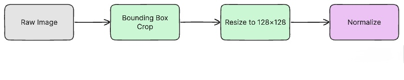
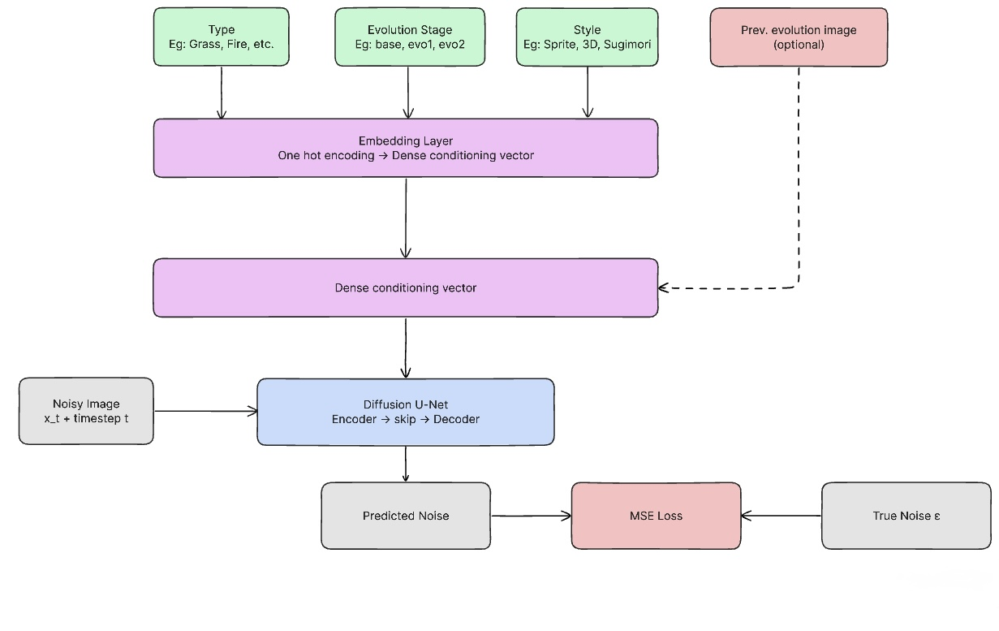
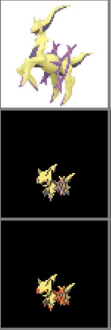
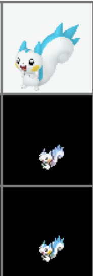

# **Diffusion-Based Generation of Novel Pokemon with Conditional Evolution Modeling**

## 1. Project Overview

The goal of this project is to build a conditional image-generation system that can produce novel Pokemon designs while preserving important structural properties of the Pokemon domain, including elemental style cues, evolution stage progression, and stylistic consistency across artwork formats. Our current direction uses a conditional diffusion model with a U-Net backbone and structured attribute conditioning.

At the interim stage, the strongest progress has been in data collection, preprocessing, and curation. We have assembled multiple Pokemon image sources, written scripts to align images across formats, and manually reviewed a curated subset of mappings that will support later model training and evaluation. The core training pipeline is still being finalized, so this report focuses on completed data work, the planned neural network design, code organization, and the evaluation framework that will be used once training runs are complete.

## 2. Data Collection, Processing, and Curation

For our project, we have collected a large amount of structured image data that has been processed and curated. The dataset currently combines three complementary visual sources:

- **SugimoriSprites**: official-style 2D Pokemon artwork used as high-quality reference art
- **PokeSprite**: compact game-style sprite assets used as the target sprite representation
- **ProjectPokemon / related render assets**: large 3D render images used as an additional visual source for cross-format alignment

The current repository already contains the following processed artifacts:

- `mapping_sugimori_to_sprite.csv`: **1,710** automatically generated Sugimori-to-sprite mappings across **905** Pokemon folders
- `edited_mapping_sugimori_to_sprite.csv`: **977** manually edited and verified Sugimori-to-sprite mappings across **830** Pokemon folders
- `mapping_3d_to_sprite.csv`: **2,676** 3D-to-sprite mappings across **905** Pokemon folders

The raw image sources currently present in the repository include:

- `poke-data/SugimoriSprites`: **1,848** image files across **1,025** folders
- `poke-data/PokeSprite`: **2,853** image files across **905** folders

The model requires more than raw image collection. The project depends on cross-style correspondence between official artwork, sprite representations, and alternate forms. To support that need, we implemented mapping scripts that parse filenames, normalize naming differences, handle form-specific cases such as Mega and Gigantamax variants, and generate CSV files that can be reused in downstream training code.

An important part of the curation effort has been manual verification. The repository includes visualization utilities that generate page-based contact sheets for side-by-side inspection of mapped image pairs. This step is necessary because the naming conventions across sources are inconsistent, and automatic matching alone is not reliable enough for a clean training set.

### Table 1. Dataset Summary

| Dataset         | Raw Images                                                                                                                                                                                                                                                    |
| --------------- | ------------------------------------------------------------------------------------------------------------------------------------------------------------------------------------------------------------------------------------------------------------- |
| SugimoriSprites |                                                   |
| PokeSprite      |                                                                       |
| ProjectPokemon  |   |

### Pre-processing pipeline

## 3. Neural Network Design and Implementation

The planned model is intentionally more difficult than a basic unconditional image generator. Rather than training a model that only memorizes one image style, we are designing a conditional diffusion-based system that can generate Pokemon imagery under structured controls. The current design includes the following components:

- A **diffusion U-Net backbone** for iterative denoising and image synthesis
- **Attribute conditioning** for Pokemon type, evolution stage, and style
- An optional **reference-image conditioning path** so a generated Pokemon can be used to guide the generation of a plausible evolution
- A sprite-focused output space so that the final results can be used in a game-style visual setting

The motivation for this design is that Pokemon generation is not only an image synthesis problem, but also a structured conditional generation problem. A successful model should produce outputs that are visually coherent, stylistically consistent, and semantically plausible given the conditioning variables.

At this stage, most implementation effort has gone into dataset preparation because model quality depends heavily on clean, aligned supervision. The current codebase does not yet contain a finished training script for the diffusion model, but the planned implementation is grounded in established diffusion-model practice. We expect to adapt publicly available diffusion implementations and modify them for our problem setting rather than starting entirely from scratch. This is allowed by the project requirements as long as the sources are cited and the implementation is meaningfully adapted to the Pokemon generation task.

The main planned adaptation is not simply training a standard image generator. Instead, the architecture will be modified to:

- Ingest structured condition vectors for Pokemon metadata
- Support style-aware generation across multiple visual domains
- Support evolution-aware conditioning so generated forms can remain related across a chain

### Architecture Proposal

 
 
 
 
 
 
 
 
 
 
 

### Training

 
 
 
 
 
 
 
 
 
 
 
 
 

## 4. Current Performance Status and Evaluation Plan

As a preliminary baseline, we trained a GAN-based model to translate Sugimori/3D artwork into game-style sprites. The following figure shows three sample results. Each column shows the input artwork (top), the GAN-predicted sprite (middle), and the original ground-truth sprite (bottom).

### Figure 1. Preliminary GAN Results (Sugimori/3D → Sprite)

| Arceus | Pachirisu | Swampert |
|:------:|:---------:|:---------:|
|  |  |  |

The GAN captures broad color palettes and rough silhouettes, but the predicted sprites lack fine detail and sharpness compared to the ground-truth sprites. A diffusion transformer should improve global consistency and recover sharper fine-grained detail relative to this baseline.

Planned evaluation includes:

- **FID** to compare the distribution of generated images to real Pokemon images
- **SSIM** or related similarity measures for controlled image-to-image comparisons where appropriate
- **Diversity analysis** to check whether the model produces varied outputs instead of repeating near-duplicates
- **Qualitative visual review** to assess whether generated Pokemon respect conditioning attributes and plausible evolution structure

If time allows, we may also compare different conditioning settings, such as:

- Unconditional generation vs. attribute-conditioned generation
- Generation with and without evolution-reference input
- Different image styles or target resolutions

## 5. Next Steps
The remaining project objectives are:

1. Finalize the training pipeline and convert the curated dataset into DataLoader-ready format.
2. Run a baseline diffusion experiment on sprite images.
3. Add conditioning for Pokemon type, evolution stage, and style embeddings.
4. Train and compare generated outputs on held-out Pokemon examples.
5. Perform an ablation study to measure the impact of each conditioning component.
6. Produce a visual summary of generated Pokemon designs for the final presentation.

## 6. Conclusion

The project is currently strongest in the area of data collection, preprocessing, and dataset curation. We have already collected multiple Pokemon image sources, generated thousands of structured cross-format mappings, and manually verified a substantial subset of aligned pairs for downstream use. This work is a necessary foundation for the model because conditional generation quality will depend heavily on the accuracy of these correspondences.

The neural network component is conceptually ambitious: a conditional diffusion model with structured metadata conditioning and evolution-aware generation. Although final training results are not yet available, the design is appropriately complex for the project scope and is grounded in established diffusion-model literature and open-source implementations that will be adapted to this domain.

The next milestone is to convert the curated dataset into a finalized training pipeline, run baseline and conditioned experiments, and populate the currently blank tables and figures with real results.

## 7. References

[1] Ho, J., Jain, A., and Abbeel, P. _Denoising Diffusion Probabilistic Models_. NeurIPS, 2020. [https://arxiv.org/abs/2006.11239](https://arxiv.org/abs/2006.11239)

[2] Ronneberger, O., Fischer, P., and Brox, T. _U-Net: Convolutional Networks for Biomedical Image Segmentation_. MICCAI, 2015. [https://arxiv.org/abs/1505.04597](https://arxiv.org/abs/1505.04597)

[3] Saharia, C., Chan, W., Saxena, S., et al. _Palette: Image-to-Image Diffusion Models_. SIGGRAPH, 2022. [https://arxiv.org/abs/2111.05826](https://arxiv.org/abs/2111.05826)

[4] Hugging Face. _Diffusers: State-of-the-art diffusion models for image and audio generation in PyTorch_. [https://github.com/huggingface/diffusers](https://github.com/huggingface/diffusers)

[5] PokéAPI. [https://pokeapi.co/](https://pokeapi.co/)

[6] msikma. _pokesprite_. [https://github.com/msikma/pokesprite](https://github.com/msikma/pokesprite)

[7] Project Pokemon. Sprite and asset resources. [https://projectpokemon.org/](https://projectpokemon.org/)

[8] Pokemon Database. National Pokedex and image resources. [https://pokemondb.net/pokedex/national](https://pokemondb.net/pokedex/national)
